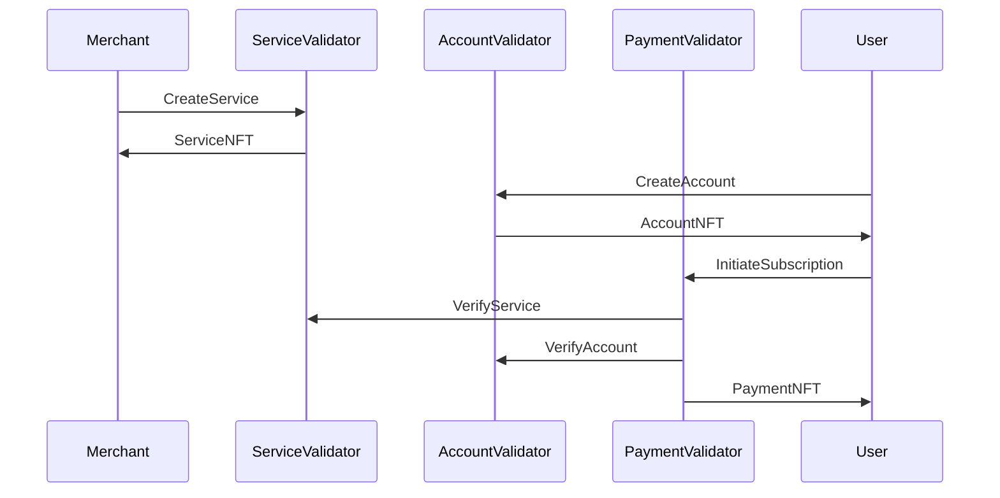

# Payment Subscription Smart Contract: Test Documentation

## Overview

This document presents comprehensive evidence of the successful implementation
and testing of the Payment Subscription Smart Contract addressing the effortless
management of recurring payments

Each section provides detailed insights into the functionality, security, and
usability of the smart contract, demonstrating its readiness for real-world
application.

Our rigorous testing suite demonstrates the contract's ability to manage
recurring payments effectively and with ease.

### 1 Test Suite Details

The test suite for the Payment Subscription Smart Contract consists of thirteen
critical test cases, each designed to verify specific aspects of the contract's
functionality.

These tests are accompanied with Aiken property based (fuzzy) tests totaling to 838 checks written to validate a variety of edge cases guaranteeing security. For the porposes of this document, we will only focus on the key tests.  

### 1.1 Test Execution Results

Below is a screenshot of all the tests as per the contract design document specifications.

```sh
-> payment-subscription$ aiken check
```

#### Service Multi-Validator


#### Account Multi-Validator


#### Payment Multi-Validator


## 2 Payment Validator Test Execution Results

### 2.1 Test Case: Initiating a Subscription (succeed_initiate_subscription)


This test validates the contract's ability to initiate a new subscription. It
ensures:

- A reference input provides the Service datum from the Service Contract.

- The subscriber’s transaction input contains the correct Account NFT (derived from the
subscriber reference token name).
- The payment output is sent to the Payment Script’s address and contain a Payment datum
that is consistent with the Service datum.
- Exactly one Payment Token (with token name “subscription”) is minted.
- The User NFT doesn’t go to the Script
- The Payment token goes back to the script

### 2.2 Test Case: Terminate Subscription (succeed_terminate_subscription)


This test verifies the contract's ability to handle contract termination, It validates that the contract must burn exactly one Payment Token (i.e. a single token with the token name “subscription” is burned).

### 2.3 Test Case: Extend Subscription (succeed_extend_subscription)


This test demonstrates the contract's ability to extend an existing subscription, showcasing the flexibility offered to subscribers. It demonstrates the successful execution of the extension transaction by ensuring:

  - The Payment UTxO being extended is identified by its output reference matching the provided reference.

  - A Service datum is supplied as a reference input, ensuring that the Service NFT is present.
  - The output UTxO remains at the Payment Script’s address and includes an updated Payment datum.
  - The new Payment datum is validated by comparing it with the current Payment datum to check that the additional locked funds correspond to the specified additional_intervals

### 2.4 Test Case: Withdrawing Subscription Fees by Merchant (succeed_merchant_withdraw)


This test confirms the contract's ability to process withdrawals of subscription
fees by a merchant. It ensures that:

  - The merchant provides an input that proves ownership of the Service NFT.

  - The Payment UTxO has a valid Payment datum which is validated against the service datum.
  - Linear vesting for fund release is implemented by:

    - Dropping the first installments_withdrawn elements from the original installments list to form the new Payment datum.

    - Verifying that the difference in the service fee value (calculated from the UTxO’s value) between the input and output does not exceed the sum of the claimable_amount of installmentsthat are past their claimable_at time.
  - The output UTxO is sent to the Payment Script’s address.

### 2.5 Test Case: Unsubscribe (succeed_unsubscribe)


This test verifies the contract's ability to process an unsubscription. It validates:

  - The subscriber provides an input containing the appropriate Account NFT.

  - The Payment UTxO being spent must carry a valid Payment datum.
  - A Service datum is provided as a reference input to verify service conditions. 
  
    The decision branch is based on the subscription’s timing:

    - **Without Penalty:** If the current time is past the original_subscription_end or if the Service is inactive, the Payment Token is burned.

    - **With Penalty:** If unsubscribing early (active service), the transaction must produce an output carrying a Penalty datum. This output must include at least the minimum penalty fee as defined by the Service datum.

### 2.6 Test Case: Withdrawing Subscription Fees by Subscriber (succeed_subscriber_withdraw)


This test verifies the contract's ability to process withdrawals of subscription
fees by a subscriber when the service becomes inactive. It validates:

  - The subscriber’s input must contain the correct Account NFT.
  
  - The Payment UTxO must have a valid Payment datum.
  - The Service datum must indicate that the Service is inactive.
  - The Payment Token is burned (ensuring exactly one token with token name “subscription” is burned).

### 2.7 User Workflow for Managing Recurring Payments

The following outlines the user workflow for managing recurring payments:

1. **Initiate Subscription:**

    - User selects a service and subscription period

    - Smart contract mints a Payment NFT and locks the subscription fee
    - User receives confirmation of successful subscription

1. **Extend Subscription:**

    - User chooses to extend their subscription

    - Off-chain calculates additional fee, new end date and intervals
    - User approves the extension
    - Contract updates the Payment Datum with new details

1. **Unsubscribe:**

    - User requests to end their subscription

    - Contract calculates refund and penalty amounts
    - User receives refund, minus any applicable penalties
    - Payment NFT is burned, ending the subscription

1. **Merchant Withdrawal:**

    - Merchant can withdraw accrued fees at any time
    
    - Contract calculates withdrawable amount based on elapsed time
    - Remaining funds stay locked until the next withdrawal or end of subscription

1. **Subscriber Withdrawal:**

    - Subscriber can withdraw remaining funds if the service becomes inactive
    - Contract verifies the inactive status of the service
    - Full remaining subscription amount is refunded to the subscriber
    - Payment NFT is burned, finalizing the withdrawal

This workflow demonstrates the ease with which users can manage their recurring
payments, from initiation to termination, directly from their wallets.

## 3 Service Validator Test Execution Results

Below are the test results for the Service Validator. This endpoint enables management of a service.

### 3.1 Create Service (success_create_service)


Validates:

  - An input is present to derive unique token names (using CIP68 prefixes).
  - That exactly one Reference Token and one User Token are minted as per the CIP68 compliance standards.
  - The unique tokens are derived from the transaction ID and output index of the input.
  - The output at is sent to the Service Script’s address.
  - The output contains a Service datum with the following requirements:

    - **service_fee:** Must be greater than 0.
    - **penalty_fee:** Must be ≥ 0.
    - **interval_length:** Must be greater than 0.
    - **num_intervals:** Must be > 0 and within a reasonable bound (e.g. ≤ 100).
    - **is_active:** Must be set to true.

### 3.2 Update Service (succeed_update_service)


Verifies:

  - A Service UTxO containing the Service NFT is provided with its output reference matching the provided reference.

  - A merchant input is present to prove ownership of the ServiceNFT (derived from service_ref_token_name).
  - The output is sent to the Service Script’s address and includes an updated Service datum.
  - That the metadata of the Reference NFT token is updated within acceptable bounds.
  - That metadata changes are within acceptable bounds.
  - The reference token is spent back to its own address, ensuring that the Service NFT remains intact.

### Remove Service (succeed_remove_service)


Confirms:

  - The transaction includes two script inputs:

    - One input containing the Service UTxO with the Service NFT.
    - A merchant input proving ownership of the Service NFT.
  - Two script outputs are produced, with one of them sent to the Service Script’s address.
  - The output Service datum indicates that the service is inactivated by setting is_active to false.
  - The Service NFT is still present in the output to maintain correct state tracking.

## 4 Account Validator Test Execution Results 

### 4.1 Create Account (success_create_account)


Validates:

  - An input must be present to derive unique token names using CIP68 prefixes.
  - Validate that exactly one Account Reference Token and one Account User Token are minted and the unique tokens are generated from the transaction’s ID and output index.
  - Ensure the output (at output_index) must be sent to the Account Script’s address and must carry an Account datum.
  - Ensure the datum includes valid account detail:

    - email_hash: Must be 32 bytes long, or
    - phone_hash: Must be 32 bytes long.
  - The User NFT must not be sent to the script.
  - The Reference NFT must be preserved at the script address.

### 4.2 Delete Account (succeed_delete_account)


Verifies:

  - That the redeemer only burns one Account Reference Token and one Account User Token.

  - There should be no remaining account-related tokens in the transaction after burning.

### 4.3 Update Account (succeed_update_account)


Tests:

  - That an Account UTxO containing the Account NFT is present in the inputs.

  - A user input (at user_input_index) must include the Account User Token, proving ownership.
  - The output is sent to the Account Script’s address and it must carry an updated Account datum.
  - The updated Account datum must satisfy metadata validation, ensuring that contact details remain correctly formatted.
  - The Reference NFT must be forwarded correctly to the spending endpoint.

### 4.4 Remove Account (succeed_remove_account)


Confirms:

  - The transaction includes an Account UTxO (at account_input_index) containing the Account NFT.
  
  - A user input (at user_input_index) must be present to prove ownership via the Account User Token.
  - The redeemer must burn the Account Reference NFT, which is validated by confirming that the minted value includes a burn (i.e. a negative quantity) for the reference token.

## 5 Service-Account-Payment Workflow



## Conclusion

The Payment Subscription Smart Contract demonstrates robust functionality and
ease of use. Through comprehensive testing and thoughtful implementation, it
effectively manages recurring payments, allowing users to initiate, extend, and
terminate subscriptions directly from their preferred wallet applications.

These features collectively ensure that the contract meets the needs of both
service providers and subscribers, offering a secure and user-friendly solution
for managing subscription-based services on the Cardano blockchain.
